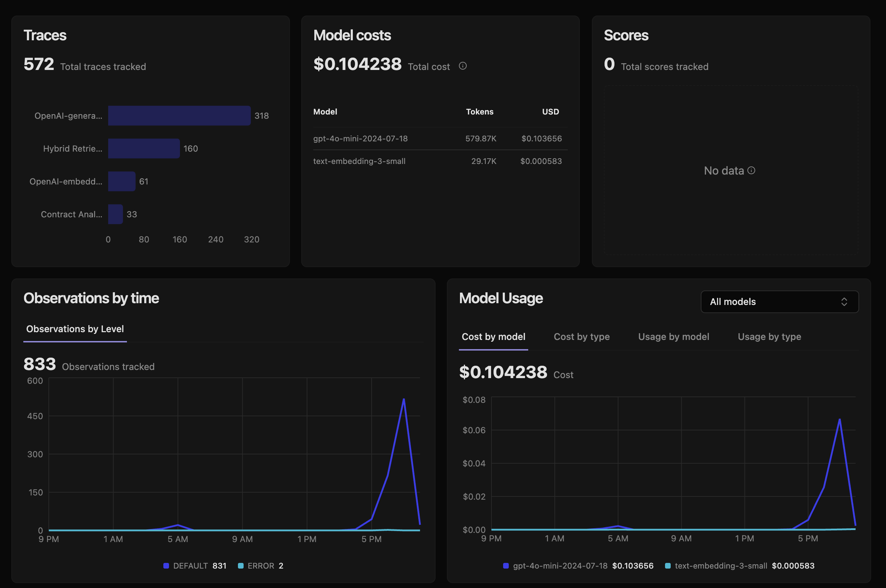
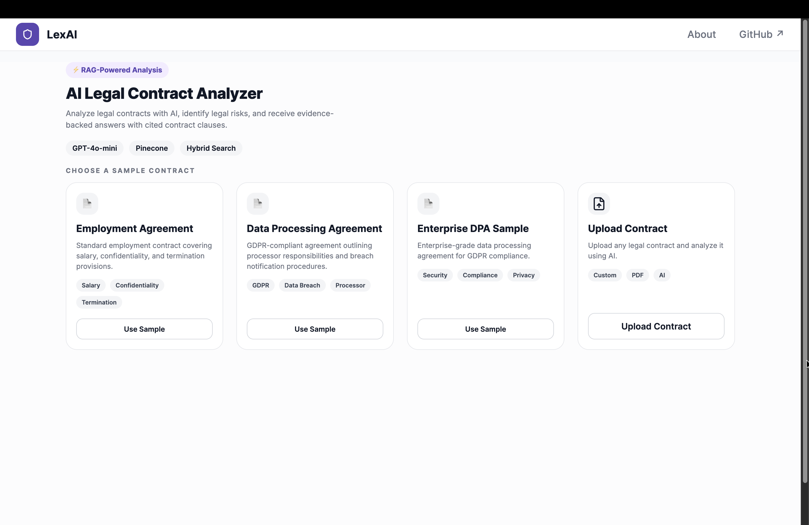
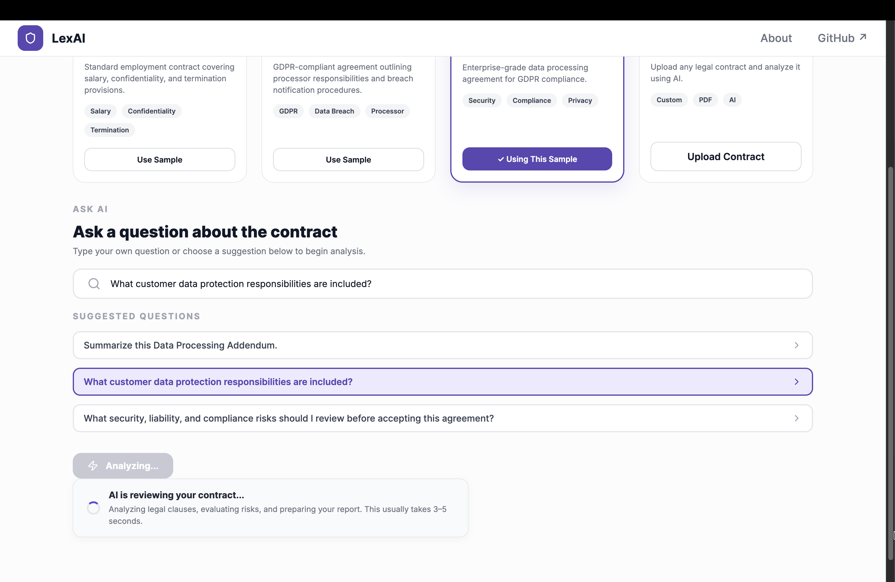
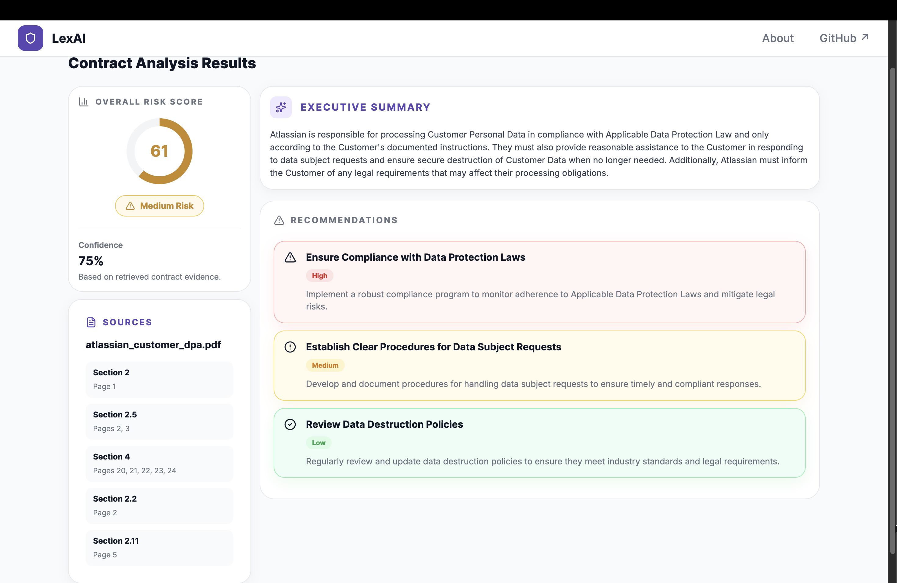
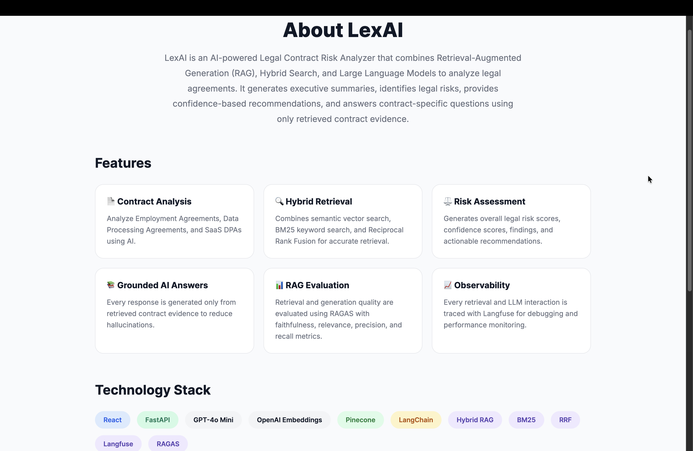

# ⚖️ LexAI – AI-Powered Legal Contract Risk Analyzer

An end-to-end **Retrieval-Augmented Generation (RAG)** application that analyzes legal contracts, identifies potential legal risks, answers contract-specific questions with evidence-backed responses, and provides actionable recommendations before signing.

LexAI combines **Hybrid Retrieval (BM25 + Vector Search)**, **OpenAI GPT-4o-mini**, **Pinecone**, **FastAPI**, **React**, **LangFuse**, and **RAGAS** to deliver grounded and explainable legal contract analysis.

---

## Demo

**Live Demo:** Coming Soon (Hugging Face Spaces)

**Frontend:** React

**Backend:** FastAPI

---

## Project Overview

Legal contracts are often lengthy, difficult to understand, and filled with clauses that may expose individuals or businesses to financial, legal, and regulatory risks.

LexAI helps users understand contracts before signing by retrieving the most relevant clauses from the uploaded document and generating AI responses grounded entirely on those clauses.

Unlike a traditional chatbot, LexAI uses a **Retrieval-Augmented Generation (RAG)** pipeline, ensuring that every answer is based on actual contract content rather than relying solely on the language model's internal knowledge.

The system also performs legal risk assessment by generating:

- Executive summary
- Risk score (0–100)
- Risk level (Low / Medium / High)
- Confidence score
- Key legal findings
- Actionable recommendations
- Source-backed evidence

---

# Key Features

- Upload and analyze custom PDF contracts
- Built-in sample legal contracts
- Semantic document chunking
- Hybrid Retrieval (BM25 + Dense Vector Search)
- Pinecone Vector Database
- GPT-4o-mini grounded contract analysis
- Executive contract summaries
- AI-generated legal risk scoring
- Risk level classification
- Confidence estimation
- Key findings extraction
- Actionable legal recommendations
- Evidence-backed answers
- FastAPI REST API
- Modern React frontend
- LangFuse tracing and observability
- RAGAS evaluation framework

---

# System Architecture

> **(Insert Architecture Diagram Here)**

Recommended diagram:

```
PDF Contract
      │
      ▼
Text Extraction
      │
      ▼
Semantic Chunking
      │
      ▼
OpenAI Embeddings
      │
      ▼
Pinecone Vector Database
      │
      │
BM25 Keyword Search
      │
      ▼
Hybrid Retrieval
      │
      ▼
GPT-4o-mini
      │
      ▼
Structured Risk Analysis
      │
      ▼
React Dashboard
```

---

# System Workflow

1. Upload a PDF contract or select a sample agreement.
2. Extract text from the document.
3. Perform semantic chunking.
4. Generate embeddings using OpenAI.
5. Store embeddings in Pinecone.
6. Build a BM25 keyword index.
7. Perform Hybrid Retrieval (Vector + BM25).
8. Retrieve the most relevant contract clauses.
9. Generate grounded responses using GPT-4o-mini.
10. Return:
   - Executive Summary
   - Risk Score
   - Risk Level
   - Confidence Score
   - Findings
   - Recommendations
11. Display results through the React frontend.

---

# Tech Stack

| Layer | Technology |
|--------|------------|
| Frontend | React |
| Backend | FastAPI |
| Language Model | OpenAI GPT-4o-mini |
| Embeddings | text-embedding-3-small |
| Vector Database | Pinecone |
| Hybrid Retrieval | BM25 + Dense Vector Search |
| Framework | LangChain |
| Evaluation | RAGAS |
| Monitoring | LangFuse |
| Programming Language | Python |

---

# Project Structure

```
legal-contract-risk-analyzer/

├── app/
│   ├── analyzer.py
│   ├── retriever.py
│   ├── hybrid_retriever.py
│   ├── vector_store.py
│   ├── embeddings.py
│   ├── llm.py
│   ├── main.py
│   └── ...
│
├── frontend/
│   ├── src/
│   └── ...
│
├── evaluation/
│   ├── datasets/
│   ├── rag_evaluator.py
│   └── ...
│
├── contracts/
│
├── scripts/
│
├── tests/
│
├── screenshots/
│   ├── home.png
│   ├── analysis-loading.png
│   ├── results-dashboard.png
│   ├── about-page.png
│   └── langfuse-dashboard.png
│
└── README.md
```

---

# RAG Pipeline

LexAI uses a Hybrid Retrieval pipeline instead of relying solely on dense vector search.

The retrieval process consists of:

- Semantic embeddings using OpenAI
- Pinecone vector similarity search
- BM25 keyword retrieval
- Reciprocal Rank Fusion (RRF)
- GPT-4o-mini answer generation

This approach improves retrieval quality while reducing hallucinations and ensuring responses remain grounded in the original contract.

---

# Evaluation (RAGAS)

The retrieval pipeline was evaluated using a manually curated dataset containing **20 legal contract questions** across multiple contract types.

## Results

| Metric | Score |
|---------|------:|
| Faithfulness | **0.923** |
| Answer Relevancy | **0.697** |
| Answer Correctness | **0.449** |
| Context Precision | **0.569** |
| Context Recall | **0.558** |
| Document Hit Rate | **0.950** |

These evaluation metrics demonstrate that the retrieval pipeline consistently returns relevant contract evidence while maintaining high factual grounding.

---

# LangFuse Observability

LangFuse is integrated to monitor every LLM interaction.

Tracked metrics include:

- Prompt tracing
- Token usage
- Request latency
- Model information
- Complete execution traces

> <p align="center">
  
</p>

---

# Application Screenshots

## Home Page

<p align="center">
  
</p>

---

## AI Analysis

<p align="center">
  
</p>

---

## Results Dashboard

<p align="center">
  
</p>

---

## About LexAI

<p align="center">
  
</p>

---

## LangFuse Dashboard

<p align="center">
  
</p>

## API Endpoints

### Upload Contract

```
POST /upload
```

Uploads a PDF contract and prepares it for semantic retrieval.

---

### Analyze Contract

```
POST /analyze
```

Accepts a user question and returns:

- Executive Summary
- Risk Score
- Risk Level
- Confidence
- Findings
- Recommendations
- Retrieved Sources

---

# Installation

Clone the repository:

```bash
git clone https://github.com/YOUR_USERNAME/legal-contract-risk-analyzer.git

cd legal-contract-risk-analyzer
```

Create a virtual environment:

```bash
conda create -n legal-rag python=3.11

conda activate legal-rag
```

Install backend dependencies:

```bash
pip install -r requirements.txt
```

Install frontend dependencies:

```bash
cd frontend

npm install
```

---

# Environment Variables

Create a `.env` file:

```env
OPENAI_API_KEY=

PINECONE_API_KEY=

PINECONE_INDEX_NAME=

LANGFUSE_SECRET_KEY=

LANGFUSE_PUBLIC_KEY=

LANGFUSE_HOST=https://cloud.langfuse.com
```

---

# Run the Application

Backend

```bash
uvicorn app.main:app --reload
```

Frontend

```bash
cd frontend

npm run dev
```

---

# Future Improvements

- Multi-document comparison
- PDF clause highlighting
- Streaming AI responses
- Multi-language contract support
- Authentication and user accounts
- Contract version comparison
- OCR support for scanned contracts
- Enterprise workspace management

---

# License

This project is licensed under the MIT License.

---

# Acknowledgements

- OpenAI
- Pinecone
- LangChain
- FastAPI
- React
- LangFuse
- RAGAS